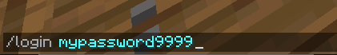

# Login

Theres two method for login to the server

### Offline users

You need to type manually every login in the chat `/login mypassword9999`

### Premium users


Do not use this command if you are not premium users!


If you are user that buy minecraft originally from Mojang we have a automatic login for you, so you dont have to type login every single time you trying to login to the server. How to do it? so first of all you must [register](register.md#register) or login `/login (your password)` (if you already logout from server) and simply type `/premium`, just follow the simple instruction in the chat and you are done. Now every single time you trying to join the server you account is automatically login.

